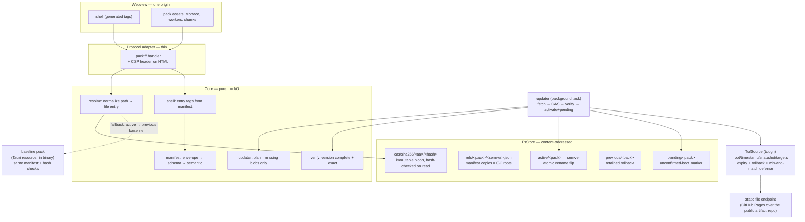
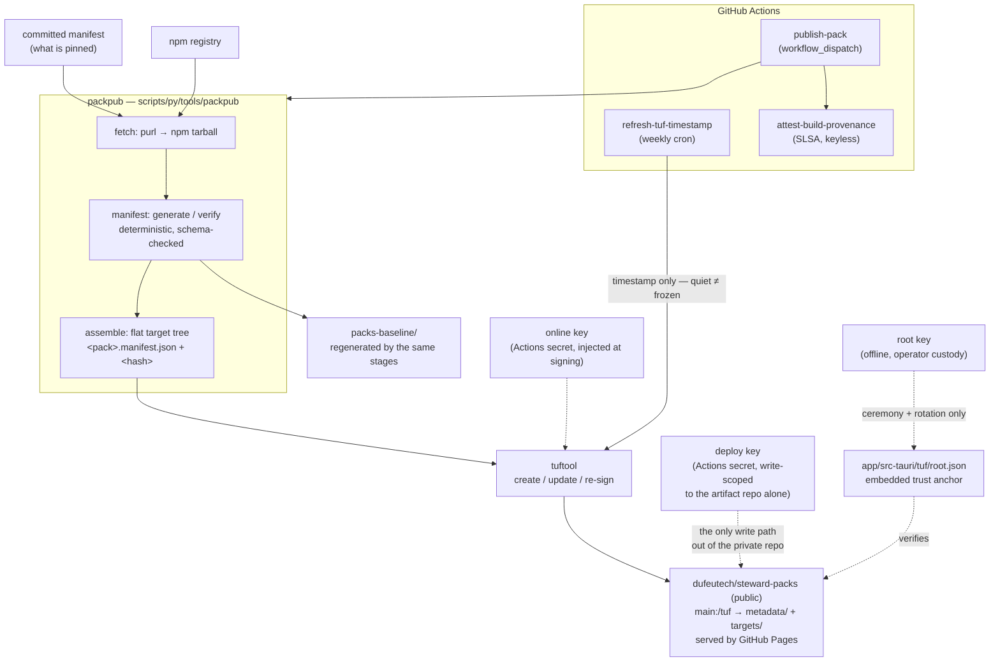

# Asset-pack system

How the app serves its frontend: one custom protocol (`pack://`, origin
`http://pack.localhost`) serves the shell and every asset pack from a single origin.
Rust never learns what an asset is — it resolves `(pack, version, path) → bytes` and
verifies hashes. Script/style tags are generated from the active pack's manifest.



## The publisher half

What fills that endpoint. The payload is fetched from the origin the committed manifest
records, verified against it, laid out as targets, and signed — so what gets published is
always what the repository pins, and an incomplete or drifted release fails before
anything is exposed.



Freshness is the part with no natural trigger: TUF clients treat expired metadata as
stale rather than up-to-date, so a publisher with nothing to release must still re-sign.
The weekly refresh is that heartbeat, and its failure is meant to be loud.

The endpoint is a second, public repository rather than a branch of this one. GitHub Pages
cannot serve a private repository on the Free plan, and splitting them is the shape worth
keeping anyway: everything on the serving side is public by design (TUF metadata is meant
to be world-readable), and the internet-facing repository never holds write access to the
source. Operating it is [`docs/runbooks/pack-publishing.md`](../runbooks/pack-publishing.md).

Key custody and rotation: `docs/runbooks/tuf-root-ceremony.md`. End-to-end proof that
this half and the client agree: `app/src-tauri/tests/tuf_end_to_end.rs`.

## Boot outcome protocol

```mermaid
sequenceDiagram
    participant U as updater
    participant S as store
    participant W as webview shell

    U->>S: activate(v2) + pending marker
    Note over W: next reload serves v2
    alt shell boots
        W->>S: shell_ready → clear pending
        Note over S: v2 confirmed; v1 stays as previous
    else shell fails (or app crashes before ready)
        W-->>S: shell_failed (or pending found at next startup)
        S->>S: rollback → v1 active again
        S-->>W: reload
    end
```

Events: `event:assets.pack_activated` / `event:assets.pack_rolled_back`
(`app/src-tauri/schemas/events.asyncapi.yaml`).

Contracts: manifest schema `app/src-tauri/schemas/pack.manifest.schema.json`;
behavior specs in `openspec/` (capabilities `asset-serving`, `pack-store`,
`pack-update`, `pack-manifest`, `baseline-boot`).
