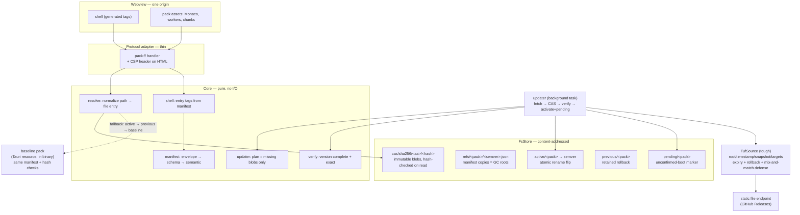

# Asset-pack system

How the app serves its frontend: one custom protocol (`pack://`, origin
`http://pack.localhost`) serves the shell and every asset pack from a single origin.
Rust never learns what an asset is — it resolves `(pack, version, path) → bytes` and
verifies hashes. Script/style tags are generated from the active pack's manifest.



## Boot outcome protocol

```mermaid
sequenceDiagram
    participant U as updater
    participant S as store
    participant W as webview shell

    U->>S: activate(v2) + pending marker
    Note over W: next reload serves v2
    alt shell boots
        W->>S: shell_ready → clear pending
        Note over S: v2 confirmed; v1 stays as previous
    else shell fails (or app crashes before ready)
        W-->>S: shell_failed (or pending found at next startup)
        S->>S: rollback → v1 active again
        S-->>W: reload
    end
```

Events: `event:assets.pack_activated` / `event:assets.pack_rolled_back`
(`app/src-tauri/schemas/events.asyncapi.yaml`).

Contracts: manifest schema `app/src-tauri/schemas/pack.manifest.schema.json`;
behavior specs in `openspec/` (capabilities `asset-serving`, `pack-store`,
`pack-update`, `pack-manifest`, `baseline-boot`).
