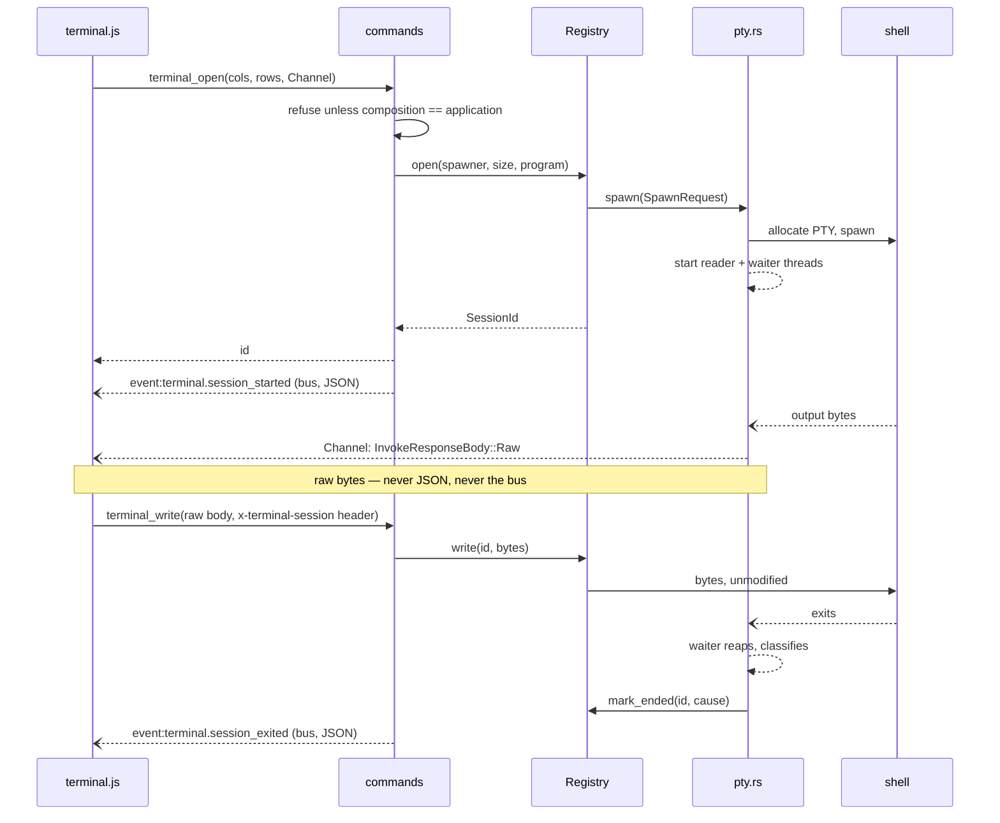
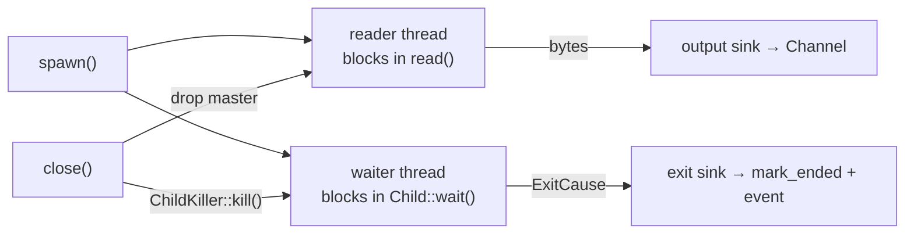
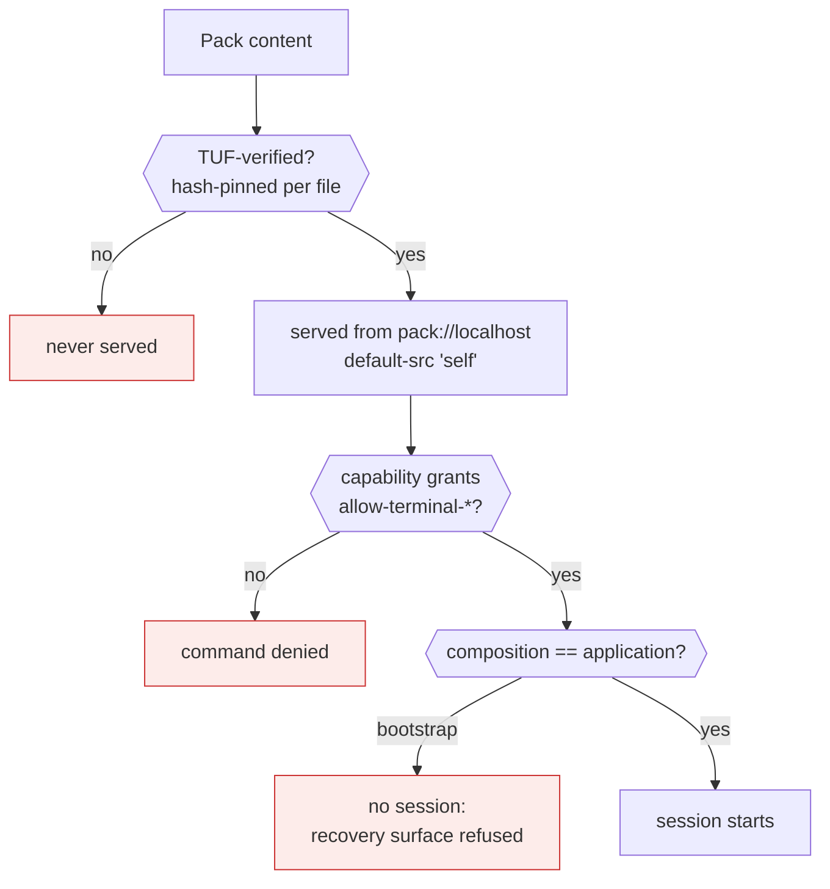

# Terminal sessions

How an interactive shell reaches the screen. Describes what **is** — the code in
`app/src-tauri/src/core/terminal/`, `app/src-tauri/src/adapters/`, and
`app/packs/terminal/`.

The terminal is a second bounded context alongside [the asset-pack
system](asset-pack-system.md). The two meet in exactly two places: the composition root
(`lib.rs`), and the fact that the terminal's surface is delivered as a pack like any other.

## The shape

```mermaid
flowchart TB
    subgraph pack["terminal pack — pack:assets.terminal"]
        xterm["xterm.js 6<br/>+ fit + unicode11<br/><i>renders, parses VT, answers queries</i>"]
        surface["terminal.js<br/><i>panel, session wiring</i>"]
        surface --- xterm
    end

    subgraph root["composition root — lib.rs"]
        cmds["terminal_open / write / resize / close / config<br/><i>thin: translate and delegate</i>"]
        gate{{"composition == application?"}}
        state["Sessions: Mutex&lt;Registry&gt;<br/>Spawner: Box&lt;dyn PtySpawner&gt;"]
    end

    subgraph core["core::terminal — pure, no I/O"]
        registry["Registry<br/><i>issues ids, refuses unknown/ended</i>"]
        session["Size · ExitCause · SessionError<br/><i>validates, classifies</i>"]
        port["`Pty` + `PtySpawner`<br/><b>ports</b>"]
        registry --- session
        registry --- port
    end

    subgraph adapters["adapters — everything that touches the OS"]
        ipc["terminal_ipc.rs<br/><i>Channel ↔ bytes, shell choice</i>"]
        ptyimpl["pty.rs — NativePtySpawner<br/><i>implements the ports</i>"]
    end

    shell["OS shell<br/>pwsh · zsh · sh"]

    surface -- "invoke (raw bytes + Channel)" --> cmds
    cmds --> gate
    gate -- yes --> state
    state --> registry
    cmds -.-> ipc
    ipc -.-> port
    ptyimpl -- implements --> port
    ptyimpl <== "PTY: ConPTY / openpty" ==> shell

    classDef pure fill:#eef7ee,stroke:#4a7,stroke-width:1px
    classDef edge fill:#fff4e6,stroke:#d90,stroke-width:1px
    class core,registry,session,port pure
    class adapters,ipc,ptyimpl edge
```

Dependencies point inward. `core::terminal` imports nothing from `adapters`, nothing from
the assets context, and no PTY library type ever crosses back into it — which is what makes
the whole core testable with no process spawned.

## Two paths, deliberately different

Bytes and facts do not travel the same way, and that is the load-bearing decision here.



**Output bytes go down a per-session `Channel` as `InvokeResponseBody::Raw`; lifecycle facts
go on the app event bus as JSON.** Routing a build's output through the bus would force
base64 over the densest traffic in the application and make every listener parse a stream
that concerns one surface. The two event names are described in
[`schemas/terminal.events.asyncapi.yaml`](../../app/src-tauri/schemas/terminal.events.asyncapi.yaml);
output deliberately appears nowhere in that document, because it is not a domain fact.

## Two threads per session, and why



Exit is **not** inferred from the reader reaching EOF. Under ConPTY the master read side
stays open after the shell exits, so an EOF-only design reports no exit at all on Windows —
measured against a real shell, not theorised. Closing uses a `ChildKiller` cloned from the
child rather than locking it, because sharing one lock between the killer and the waiter
deadlocks: the killer would wait for a lock the waiter holds until the process it is waiting
for is killed.

## The execution boundary

A terminal is arbitrary code execution as the user — a strictly larger authority than
anything else the application grants. Three layers, none sufficient alone:



1. **TUF verification is the primary control.** Content that could ask for a shell only gets
   in front of the user by being signed.
2. **Capability gating** — the commands are declared in `build.rs` via
   `AppManifest::commands`, which is what makes application-defined commands permissionable
   at all, and `capabilities/terminal.json` grants them to the `main` window.
3. **Composition gating** — layer 2 cannot do this job. Capabilities are scoped per window,
   and this app renders the bootstrap recovery surface and the application surface in the
   same `main` window, so `terminal_open` makes the distinction itself.

## Where each concern lives

| Concern                                              | Home                                                |
| ---------------------------------------------------- | --------------------------------------------------- |
| Which shell starts, scrollback bound                 | `config/app.config.json` → `core::terminal::config` |
| Session identity, size validity, exit classification | `core::terminal`                                    |
| PTY allocation, threads, reaping                     | `adapters/pty.rs`                                   |
| Channel and raw-body translation                     | `adapters/terminal_ipc.rs`                          |
| Wiring, gating, event emission                       | `lib.rs`                                            |
| Rendering, input encoding, scrollback                | `app/packs/terminal/`                               |

## Related

- [`asset-pack-system.md`](asset-pack-system.md) — how the surface is delivered and verified.
- [`DEV.md`](../../DEV.md) — running the app.
- [`docs/runbooks/pack-publishing.md`](../runbooks/pack-publishing.md) — publishing a pack.
- The change's [`design.md`](../../openspec/changes/terminal-surface/design.md) — the ADRs
  and the measurements behind them.
